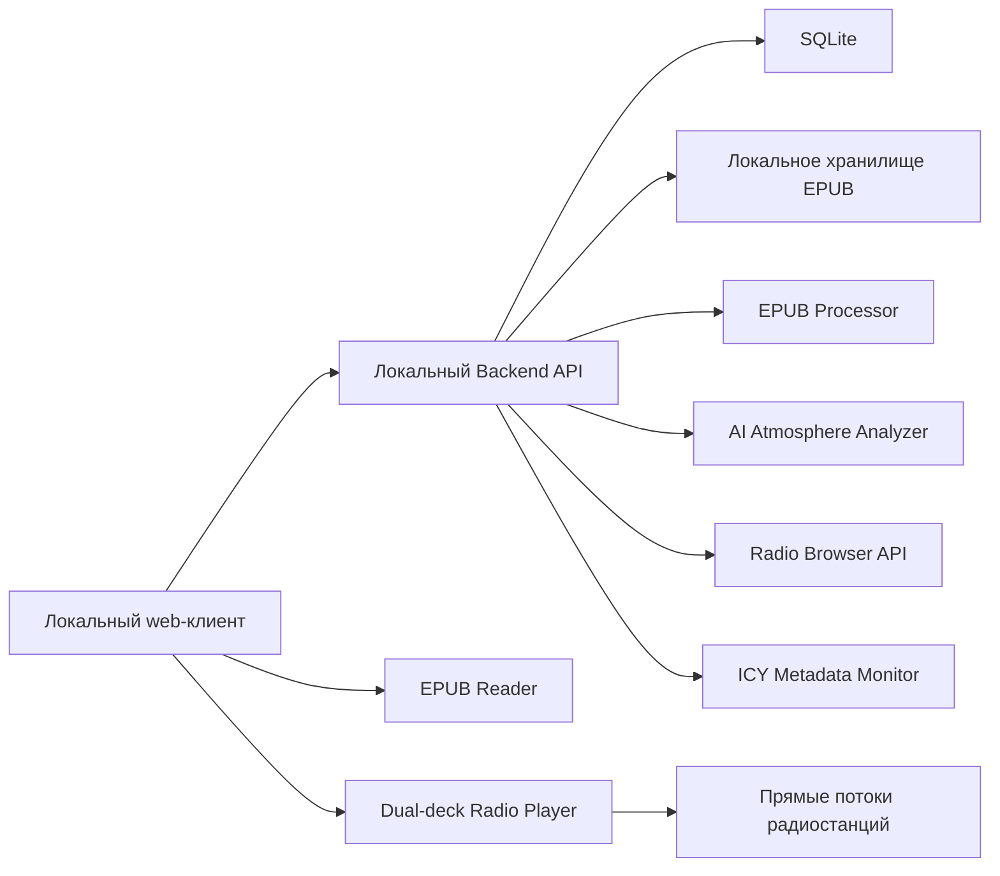

# Audioplayer — продуктово-техническая спецификация

**Статус:** Draft v0.3

**Дата:** 5 сентября 2026

**Формат:** однопользовательское некоммерческое демо для личного использования
**Назначение:** зафиксировать продуктовую концепцию, границы демо и технический подход

## 1. Краткое описание

Audioplayer — локально запускаемый веб-сервис для чтения EPUB с автоматически подобранным интернет-радио на фоне.

Работа начинается с загрузки книги. Сервис извлекает её структуру и метаданные, анализирует атмосферу текста, находит подходящие интернет-радиостанции и запускает лучший доступный поток вместе с веб-читалкой. Пользователь не выбирает источник или режим сопровождения: в демо используется единая модель **Atmosphere Radio**.

Все загруженные книги сохраняются в локальной библиотеке и отображаются в общей галерее демо. Регистрация, многопользовательский доступ, публичная публикация книг и коммерческое использование не поддерживаются.

## 2. Цель демо

Демо должно проверить одну основную гипотезу:

> Может ли автоматически подобранное живое радио усилить атмосферу чтения электронной книги, не отвлекая пользователя?

Для проверки необходимо реализовать полный вертикальный сценарий:

1. загрузить EPUB;
2. проанализировать книгу;
3. выбрать подходящую радиостанцию;
4. открыть читалку;
5. запустить радио;
6. при необходимости плавно переключиться на более подходящую станцию;
7. сохранить книгу и прогресс локально.

Демо не предназначено для проверки монетизации, масштабирования, социальных функций или интеграций с музыкальными подписками.

## 3. Пользователь и контекст

Демо рассчитано на одного владельца локальной установки, который:

- регулярно читает художественные EPUB-книги;
- уже включает ambient, instrumental, lo-fi или саундтреки во время чтения;
- хочет начать чтение без ручного поиска музыки;
- согласен с тем, что радио является живым и не полностью предсказуемым источником.

## 4. Принципы продукта

1. **Книга остаётся главной.** Радио не должно конкурировать с текстом.
2. **Нулевой выбор на старте.** После загрузки сервис сам предлагает готовый результат.
3. **Локальность по умолчанию.** EPUB, извлечённый текст и прогресс остаются внутри личной установки.
4. **Никаких спойлеров.** Анализ будущих глав не отображается пользователю.
5. **Плавность важнее мгновенной точности.** Сервис не переключает станцию при каждом небольшом изменении атмосферы.
6. **Чтение не зависит от радио.** Сбой анализа или потока не блокирует книгу.
7. **Открытый каталог не означает открытый контент.** Radio Browser предоставляет метаданные и ссылки, но не выдаёт права на сами эфиры.

## 5. Основной пользовательский сценарий

1. Пользователь открывает стартовую страницу.
2. Загружает EPUB.
3. Сервис проверяет файл и извлекает название, автора, обложку, оглавление и текст.
4. Книга сразу появляется в галерее со статусом обработки.
5. AI формирует общий атмосферный профиль и профиль глав.
6. Сервис ищет пул подходящих радиостанций и проверяет доступность потоков.
7. Для станций с ICY-метаданными сервис оценивает также текущую композицию или программу.
8. Пользователь открывает книгу кнопкой «Начать чтение».
9. Браузер запускает лучшую найденную станцию и открывает читалку.
10. По ходу чтения сервис сохраняет позицию и периодически пересчитывает пригодность текущей станции.
11. Если другая станция заметно лучше, выполняется плавное переключение.
12. При следующем открытии книга продолжается с сохранённого места и нового актуального эфира.

## 6. Atmosphere Radio

Atmosphere Radio — единственный источник музыкального сопровождения в демо.

### 6.1. Источник станций

На первом этапе используется Radio Browser — открытый каталог метаданных интернет-радиостанций. Из него можно получить:

- название и домашнюю страницу станции;
- исходный и разрешённый URL потока;
- жанровые теги;
- язык и страну;
- кодек и битрейт;
- признак HLS;
- результаты последних проверок доступности;
- популярность и пользовательские голоса.

Каталог используется только для поиска. Аудио передаётся напрямую от станции в браузер, без записи и серверной ретрансляции.

### 6.2. Формирование пула

Для атмосферного профиля книги сервис запрашивает станции по комбинациям тегов, например:

```text
fantasy + ambient + instrumental
dark + cinematic + soundtrack
cozy + jazz + lounge
space + electronic + ambient
historical + classical
```

Кандидаты фильтруются по следующим признакам:

- успешная последняя проверка;
- HTTPS-поток, если доступен;
- поддерживаемый браузером кодек;
- достаточный битрейт;
- отсутствие известных разговорных форматов;
- предпочтение instrumental/ambient-станциям;
- отсутствие повторяющихся ошибок воспроизведения;
- локальный denylist нежелательных станций.

### 6.3. Оценка текущего эфира

Если станция передаёт `StreamTitle` или другие ICY-метаданные, сервис извлекает `Artist — Track` и рассчитывает оценку соответствия.

Пример факторов:

| Фактор | Пример влияния |
|---|---:|
| Соответствие тегов станции атмосфере книги | 35% |
| Соответствие текущего трека или программы | 25% |
| Инструментальность и отсутствие речи | 15% |
| Стабильность и доступность потока | 10% |
| Качество и битрейт | 5% |
| История успешного воспроизведения в демо | 10% |

Если метаданных нет, оценка строится по профилю станции и истории наблюдений. Анализ самого аудиосигнала не является обязательной частью первой версии.

### 6.4. Выбор станции

Сервис выбирает станцию автоматически. Переключение допускается, если одновременно выполняются условия:

- текущая станция стала недоступна; либо
- оценка новой станции превышает оценку текущей на заданный порог;
- текущая станция играла не меньше минимального времени;
- новая станция успешно подготовила аудиопоток;
- не превышен лимит переключений за сессию.

Начальные значения:

```text
минимальное время на станции: 10 минут
минимальное улучшение оценки: 20 пунктов из 100
максимум автоматических переключений: 3 в час
таймаут подготовки потока: 8 секунд
```

Значения являются конфигурацией демо и уточняются после ручного тестирования.

### 6.5. Неподходящий эфир

Радио может содержать рекламу, ведущего, новости, вокал или композицию, не соответствующую книге. В демо используются следующие меры:

- преимущество узкотематических instrumental/ambient-станций;
- локальный allowlist хорошо работающих станций;
- локальный denylist;
- кнопка «Не подходит» для немедленного поиска альтернативы;
- временное снижение рейтинга станции;
- отключение радио, если подходящих кандидатов нет.

## 7. Плавное переключение радиостанций

Плавный переход нужен не между композициями одной станции — ими управляет эфир, — а между двумя live-потоками при смене станции.

### 7.1. Поведение

- стандартная длительность перехода: 8 секунд;
- текущая станция постепенно затихает;
- новая станция сначала подключается без звука и заполняет буфер;
- после подтверждения воспроизведения новая станция плавно усиливается;
- если одновременное воспроизведение невозможно, используется fade-out, переключение и fade-in;
- при ошибке нового потока текущая станция продолжает играть;
- переход не должен происходить во время загрузки страницы или взаимодействия с настройками чтения.

### 7.2. Технический подход

В браузере используются два аудиоканала:

- `Deck A` воспроизводит текущую станцию;
- `Deck B` подготавливает следующую;
- громкость двух `HTMLAudioElement` управляется equal-power-кривыми; это не требует доступа к содержимому стороннего потока через Web Audio API;
- после успешного перехода роли каналов меняются;
- соединение со старой станцией закрывается после завершения fade;
- состояние плеера не хранит и не записывает аудиоданные.

Crossfade включается только для потоков, которые браузер может воспроизводить напрямую и одновременно. Ограничения CORS, autoplay, кодека или самой станции могут привести к запасному переходу через короткую тишину.

## 8. Галерея и хранение книг

В демо галерея является общей домашней страницей единственного пользователя и показывает все ранее загруженные книги.

Карточка книги содержит:

- обложку;
- название и автора;
- язык и ISBN, если они есть;
- статус анализа;
- общий атмосферный профиль;
- прогресс чтения;
- дату последнего открытия;
- текущую рекомендованную категорию радио;
- действия «Продолжить» и «Удалить».

EPUB, извлечённый текст, закладки и прогресс не публикуются в интернет. После удаления книги удаляются оригинал, извлечённые данные, атмосферный профиль и сохранённая позиция.

## 9. Роль AI

AI выполняет роль классификатора атмосферы книги и ранжировщика радиостанций.

### Входные данные

- текст и структура EPUB;
- текущая глава и прогресс чтения;
- библиографические метаданные;
- теги и технические параметры станций;
- ICY-метаданные текущего эфира;
- локальная история доступности и оценок;
- сигнал «Не подходит».

### Результаты

- общий профиль книги;
- профили отдельных глав или крупных фрагментов;
- признаки `mood`, `energy`, `pace`, `instrumental_preference` и `speech_tolerance`;
- поисковые теги для Radio Browser;
- ранжированный список станций;
- оценка уверенности;
- решение остаться на станции или подготовить переключение.

### Ограничения

- AI не показывает анализ будущих событий;
- AI не публикует и не распространяет текст EPUB;
- AI не подтверждает юридическую допустимость радиопотока;
- низкая уверенность приводит к нейтральному ambient-профилю;
- решение AI не должно вызывать частые или резкие переключения;
- полный текст не используется для обучения внешней модели.

## 10. Границы демо

### Входит в демо

- загрузка и удаление EPUB;
- локальное хранение нескольких книг;
- извлечение оглавления, текста, обложки и метаданных;
- галерея всех загруженных книг;
- веб-читалка с настройками темы, шрифта и размера текста;
- локальное сохранение прогресса;
- AI-профиль книги и глав;
- поиск станций через Radio Browser;
- проверка доступности и техническая фильтрация потоков;
- чтение ICY-метаданных там, где это возможно;
- автоматический выбор станции;
- радио-плеер с play/pause, громкостью и плавным переключением;
- кнопка «Не подходит»;
- fallback без радио.

### Не входит в демо

- регистрация, вход и несколько пользователей;
- облачная синхронизация;
- публичная галерея или обмен книгами;
- магазин EPUB;
- каталоги отдельных музыкальных треков и пользовательские плейлисты;
- выбор нескольких режимов сопровождения;
- генерация музыки;
- запись, кэширование или серверная ретрансляция радио;
- коммерческое использование;
- нативные мобильные приложения;
- социальные функции.

## 11. Интерфейс и визуальная система

### 11.1. Визуальные референсы

Основные референсы находятся в Figma-файле «Радио — книги»:

- layout и распределение рабочих зон: https://www.figma.com/design/0ZFVBEgNRxph2HSW5lLrK4/?node-id=2-3
- печатная эстетика, моноширинный набор, подчёркивания и редакционные аннотации: https://www.figma.com/design/0ZFVBEgNRxph2HSW5lLrK4/?node-id=2-9
- размытые цветовые маркеры и пунктирные связи: https://www.figma.com/design/0ZFVBEgNRxph2HSW5lLrK4/?node-id=2-12
- органические формы, градиенты, свечение, зерно и шероховатые поверхности: https://www.figma.com/design/0ZFVBEgNRxph2HSW5lLrK4/?node-id=2-39

Референсы задают визуальный язык, но не копируются буквально. Интерфейс должен выглядеть как современный рабочий документ с живой радио-атмосферой, а не как музыкальный генератор или декоративный арт-проект.

### 11.2. Основной desktop layout

Экран чтения занимает всю доступную высоту и делится на две функциональные зоны:

```text
┌────────────────────────────────────────────────────────────────────┐
│ Header: библиотека / книга / статус радио                          │
├──────────────────────┬─────────────────────────────────────────────┤
│                      │                                             │
│ Music History        │              EPUB Reader                    │
│ 320 px               │              основная зона                  │
│                      │                                             │
│                      │                                             │
│ Radio Player Dock    │                                             │
├──────────────────────┴─────────────────────────────────────────────┤
└────────────────────────────────────────────────────────────────────┘
```

Правила:

- верхняя панель: 56 px;
- левая панель по умолчанию: 320 px;
- допустимая ширина левой панели: 280–380 px;
- в свёрнутом виде левая панель превращается в rail шириной 48 px;
- правая область занимает всё оставшееся пространство;
- текстовая колонка книги центрируется и имеет комфортную ширину 640–760 px;
- боковые поля читалки адаптивны, но не меньше 32 px на desktop;
- музыкальная история прокручивается независимо от книги;
- плеер закреплён в нижней части левой панели и остаётся доступным при прокрутке истории.

Книга является визуально доминирующей областью. Блюр, цветовые поля и фактуры не размещаются непосредственно под основным текстом EPUB.

### 11.3. Music History

Левая панель показывает хронологию музыкального сопровождения текущей читательской сессии:

- текущую станцию;
- время подключения;
- `StreamTitle`, если он доступен;
- краткую атмосферную метку;
- переходы между станциями;
- ошибки и fallback-состояния;
- действие «Не подходит»;
- ссылку на сайт станции.

Панель можно скрыть и открыть без остановки радио. Состояние сохраняется локально.

Интерактивные состояния:

- `expanded` — история и полный плеер;
- `collapsed` — компактный rail с индикатором эфира и play/pause;
- `loading` — поиск или подготовка станции;
- `playing` — активный эфир;
- `transitioning` — crossfade между станциями;
- `paused` — эфир приостановлен;
- `error` — поток недоступен;
- `empty` — история ещё не сформирована.

Кнопка сворачивания имеет `aria-expanded`, видимый focus state и доступна с клавиатуры. Базовая горячая клавиша для панели — `H`, если фокус не находится в поле ввода.

### 11.4. Responsive behavior

- при ширине 1024 px и меньше Music History открывается поверх читалки как drawer;
- при ширине 768 px и меньше читалка занимает весь экран, а история открывается как bottom sheet;
- компактный radio bar остаётся закреплён снизу;
- открытие панели не меняет позицию чтения;
- touch target интерактивных элементов — не меньше 44 × 44 px;
- на мобильных устройствах crossfade и autoplay могут деградировать до поддерживаемого браузером поведения.

### 11.5. Типографика

Интерфейс использует моноширинный шрифт, поддерживающий кириллицу.

Основной выбор:

```text
font.ui.family = "IBM Plex Mono", "PT Mono", ui-monospace, monospace
font.ui.label = 12 / 16, medium
font.ui.body = 14 / 20, regular
font.ui.heading.sm = 18 / 24, medium
font.ui.heading.lg = 28 / 34, medium
font.ui.tracking.label = 0.04em
```

Моноширинность относится к оболочке приложения: навигации, карточкам, метаданным, истории и плееру. Текст самой EPUB-книги сохраняет авторские стили либо использует отдельный читательский шрифт. Это необходимо для комфортного длительного чтения. Пользователь может отдельно включить моноширинный режим книги.

Текстовые акценты наследуют эстетику печатного документа:

- подчёркивания вместо лишних рамок;
- короткие uppercase-labels;
- временные метки и технические данные как поля документа;
- цветовое выделение фрагмента как полупрозрачный маркер;
- тонкие пунктирные линии только для объяснения связи между атмосферой книги и радио.

### 11.6. Цветовые токены

Базовая палитра строится вокруг тёплой бумаги и тёмной печатной краски:

```text
color.background.canvas       = #E8E2D7
color.background.paper        = #F5F1E8
color.background.paperRaised  = #FBF8F1
color.text.primary            = #242322
color.text.secondary          = #716D65
color.border.default          = #CEC7BB
color.border.strong           = #918A7F
color.action.primary          = #242322
color.action.onPrimary        = #F8F4EC
color.feedback.error          = #B84A3B
color.focus                   = #285FE8
```

Атмосферные цвета используются как мягкие полупрозрачные поля:

```text
color.atmosphere.coral        = #FF7458
color.atmosphere.blue         = #68A7F4
color.atmosphere.green        = #72A97E
color.atmosphere.yellow       = #F2C95C
color.atmosphere.violet       = #9C7CE8
```

Атмосферная палитра не кодирует критические состояния без текста или иконки. Для интерфейсного текста соблюдается контраст WCAG AA.

### 11.7. Поверхности и эффекты

```text
radius.control = 999 px
radius.panel = 2 px
radius.card = 4 px
blur.atmosphere.sm = 24 px
blur.atmosphere.md = 40 px
blur.atmosphere.lg = 64 px
opacity.grain = 0.03–0.05
border.document = 1 px
motion.fast = 140 ms
motion.base = 220 ms
motion.panel = 280 ms
```

Правила применения:

- зерно накладывается общей текстурой и не снижает читаемость;
- мягкие градиенты используются в брендинге, обложках-заглушках и индикаторе текущей атмосферы;
- blur не применяется к основному тексту, кнопкам или важным статусам;
- шероховатость имитирует бумагу, ризографию или печатную краску с очень низкой интенсивностью;
- органические формы используются как акцент, а не как контейнер для длинного текста;
- допустимы небольшие срезанные углы карточек как отсылка к layout-референсу;
- пунктирные линии не используются как обычные разделители.

Анимация атмосферных форм должна быть медленной и малозаметной. При `prefers-reduced-motion` движение отключается, сохраняя статичный градиент.

### 11.8. Компоненты первого приоритета

| Компонент | Назначение | Основные варианты и состояния |
|---|---|---|
| `AppShell` | Общий двухпанельный каркас | desktop, tablet, mobile |
| `MusicHistoryPanel` | История эфира и управление панелью | expanded, collapsed, drawer, bottom-sheet |
| `HistoryItem` | Станция, трек или системное событие | playing, past, transition, error |
| `RadioPlayerDock` | Текущая станция и базовые controls | loading, playing, paused, transitioning, error |
| `ReaderSurface` | EPUB-контент и навигация | loading, ready, chapter-change, error |
| `BookCard` | Книга в локальной галерее | processing, ready, failed |
| `UploadDropzone` | Стартовая загрузка EPUB | default, drag-over, uploading, invalid, error |
| `AtmosphereBadge` | Краткое настроение книги или эфира | neutral и атмосферные варианты |
| `AtmosphereField` | Размытый брендовый цветовой акцент | static, active, reduced-motion |
| `IconButton` | Компактные controls | default, hover, pressed, focus, disabled |

Компоненты проектируются на уровне **Component Library**: с токенами, вариантами, состояниями и правилами поведения. Полноценный UI Kit и governance не требуются для личного демо.

### 11.9. Правила качества

- текст книги остаётся читаемым при выключенных эффектах;
- свёрнутая история освобождает место, но не скрывает состояние радио полностью;
- пользователь всегда видит, какая станция играет и откуда получен поток;
- декоративные эффекты не уменьшают контраст и не маскируют ошибки;
- интерфейс не выглядит как панель для профессионального сведения музыки;
- ни один обязательный сценарий не зависит от hover;
- layout выдерживает длинные названия книг, станций и `StreamTitle`;
- все состояния радио имеют текстовую подпись;
- reader position не сбрасывается при открытии и закрытии истории.

## 12. Архитектура демо



### Рекомендуемый стек

- frontend: Next.js, React, TypeScript;
- EPUB reader: EPUB.js после проверки совместимости и лицензии;
- audio: два HTMLAudioElement с программным equal-power crossfade;
- backend: Node.js и TypeScript;
- database и file storage первой версии: IndexedDB в браузере;
- EPUB processing первой версии: локально в браузере, без отправки текста книги;
- atmosphere analyzer первой версии: детерминированная RU/EN эвристика; AI-анализ остаётся следующим этапом;
- radio directory: Radio Browser API;
- metadata: ICY/Shoutcast metadata parser;
- configuration: локальный `.env`, не попадающий в Git;
- observability: локальные структурированные логи без текста книги.

Отдельные Redis, PostgreSQL, S3, OAuth и распределённая очередь для демо не нужны.

## 13. Основные компоненты

### 13.1. Web client

- стартовый экран с загрузкой EPUB;
- галерея;
- экран обработки;
- читалка;
- скрываемая Music History слева и компактный radio player;
- индикатор текущей станции и метаданных эфира;
- действие «Не подходит»;
- состояние «радио недоступно» без блокировки чтения.

### 13.2. EPUB processor

- проверяет расширение, MIME-тип, размер и ZIP-структуру;
- защищает от архивных бомб и опасных вложений;
- извлекает метаданные, обложку и оглавление;
- санитизирует HTML/CSS перед отображением;
- разбивает текст на главы и фрагменты;
- вычисляет устойчивый hash файла для защиты от дублей.

### 13.3. Atmosphere analyzer

- анализирует книгу асинхронно;
- формирует структурированный JSON-профиль;
- версионирует результат и параметры модели;
- скрывает спойлерные признаки от интерфейса;
- создаёт Radio Browser queries;
- использует нейтральный профиль при ошибке.

### 13.4. Radio discovery service

- получает зеркала Radio Browser;
- ищет станции и обновляет локальный кэш метаданных;
- проверяет доступность и формат потока;
- применяет allowlist/denylist;
- ранжирует станции;
- сообщает браузеру прямой URL, не проксируя аудио.

### 13.5. Radio player

- управляет двумя потоками;
- обрабатывает загрузку, паузу и ошибки;
- выполняет crossfade или безопасный fallback;
- отображает название станции и текущий `StreamTitle`;
- ограничивает частоту автоматических переключений.

## 14. Модель данных

| Сущность | Назначение |
|---|---|
| `Book` | Метаданные загруженной книги и статус обработки |
| `BookAsset` | Путь к приватному EPUB и извлечённой обложке |
| `ReadingPosition` | Текущая позиция, процент и дата чтения |
| `AtmosphereSegment` | Диапазон книги и его атмосферные признаки |
| `RadioStation` | Локальный кэш метаданных станции |
| `RadioObservation` | Доступность, `StreamTitle`, ошибки и последняя оценка |
| `PlaybackSession` | Текущая книга, станция и история переключений |
| `RecommendationFeedback` | Сигнал «Не подходит» и причина, если указана |

Связь с пользователем отсутствует: установка считается принадлежащей одному локальному пользователю.

## 15. API верхнего уровня

Предварительные маршруты:

```text
POST   /api/books
GET    /api/books
GET    /api/books/:bookId
DELETE /api/books/:bookId
PUT    /api/books/:bookId/progress
GET    /api/books/:bookId/atmosphere
POST   /api/books/:bookId/analyze
POST   /api/books/:bookId/reading-session
GET    /api/reading-sessions/:sessionId/radio
POST   /api/reading-sessions/:sessionId/reject-station
POST   /api/radio/stations/:stationId/report-error
```

API не передаёт текст книги внешним клиентам, кроме локального web-клиента. URL радио возвращается напрямую; backend не ретранслирует аудио.

## 16. Безопасность и приватность

- приложение по умолчанию слушает только localhost;
- удалённый доступ не включается;
- EPUB хранится вне публичной директории web-сервера;
- локальный endpoint книги проверяет допустимый идентификатор и путь;
- полный текст не записывается в application logs;
- загружаемый архив проверяется по размеру и структуре;
- EPUB HTML и CSS санитизируются;
- внешние ссылки внутри книги блокируются или требуют подтверждения;
- секрет AI-провайдера хранится в `.env` и не отправляется в браузер;
- удаление книги каскадно удаляет производные данные;
- запросы к внешним сервисам имеют таймауты и ограничения частоты.

Если демо станет доступно из интернета или нескольким людям, отсутствие аутентификации становится блокирующей уязвимостью и должно быть устранено до публикации.

## 17. Контентные и платформенные ограничения

Демо является некоммерческим и используется лично владельцем установки. Это снижает продуктовые риски, но не отменяет условия радиостанций и права на контент.

Правила демо:

- загружается только EPUB, которым пользователь вправе пользоваться;
- файл и извлечённый текст не публикуются и не передаются другим пользователям;
- Radio Browser используется как каталог, а не как подтверждение прав на эфир;
- поток воспроизводится напрямую в браузере с сервера станции;
- радио не записывается, не скачивается и не ретранслируется backend-сервером;
- станция, потребовавшая прекратить встраивание, добавляется в denylist;
- в интерфейсе отображаются название станции и ссылка на её сайт;
- перед публичным или коммерческим запуском проводится отдельная юридическая и лицензионная проверка.

## 18. Нефункциональные требования

### Производительность

- книга появляется в галерее сразу после успешной загрузки;
- уже обработанная книга открывается не дольше 2 секунд;
- прогресс сохраняется локально без заметной задержки;
- первичный поиск радио завершается за 10 секунд либо включает состояние без радио;
- новая станция подготавливается до начала crossfade;
- длительная AI-обработка не блокирует интерфейс.

### Надёжность

- чтение работает при недоступности AI, Radio Browser или всех станций;
- неудачная подготовка новой станции не останавливает текущую;
- ошибки одной станции понижают её локальный рейтинг;
- после перезапуска сохраняются книги и прогресс;
- внешний запрос всегда имеет таймаут и ограниченное число повторов.

### Доступность

- управление читалкой и радио доступно с клавиатуры;
- доступны светлая и тёмная темы;
- размер текста регулируется;
- состояние радио передаётся не только цветом;
- пользователь может поставить эфир на паузу или выключить звук.

## 19. Метрики демо

Метрики хранятся локально и нужны для ручной оценки качества, а не для пользовательской аналитики.

### Основной сценарий

- успешность загрузки и открытия EPUB;
- время обработки книги;
- время до начала чтения;
- время до запуска радио;
- продолжительность читательской сессии.

### Качество радио

- доля сессий с найденной рабочей станцией;
- количество нажатий «Не подходит»;
- среднее время до первого отклонения станции;
- количество автоматических переключений в час;
- доля станций с полезными ICY-метаданными;
- субъективная оценка соответствия после сессии.

### Качество воспроизведения

- доля успешных crossfade;
- количество ошибок и буферизаций на час;
- доля переходов через fallback с тишиной;
- время подготовки новой станции;
- частота блокировок autoplay и CORS.

## 20. Критерии готовности демо

Демо считается готовым, если:

1. Без регистрации можно загрузить, открыть и удалить EPUB.
2. Несколько загруженных книг отображаются в общей локальной галерее.
3. Позиция чтения сохраняется между перезапусками.
4. AI формирует атмосферный профиль или безопасный fallback.
5. Сервис автоматически находит и запускает подходящую станцию.
6. Пользователь не обязан выбирать режим или настраивать источник.
7. Кнопка «Не подходит» подбирает альтернативную станцию.
8. Переключение между совместимыми потоками выполняется плавно.
9. Сбой радио не мешает читать книгу.
10. Backend не записывает и не ретранслирует радиопотоки.
11. EPUB и его текст не доступны извне локальной установки.
12. Источник станции и ссылка на неё отображаются пользователю.
13. Music History можно скрывать и открывать без остановки эфира и потери позиции чтения.
14. Desktop-интерфейс сохраняет приоритет читалки над музыкальной панелью.
15. Визуальные эффекты отключаются или упрощаются при `prefers-reduced-motion`.

## 21. Этапы реализации

### Этап 0 — технические эксперименты

- проверить Radio Browser API и выбор зеркала;
- найти 20–30 стабильных instrumental/ambient-станций;
- проверить HTTPS, CORS, кодеки и autoplay;
- проверить получение ICY-метаданных;
- собрать двухканальный прототип переключения live-потоков;
- измерить, для какой доли станций возможен crossfade.

### Этап 1 — вертикальный прототип

- загрузка одного EPUB;
- базовая читалка;
- простой атмосферный профиль;
- автоматический запрос Radio Browser;
- запуск лучшей станции;
- play/pause, громкость и «Не подходит».

### Этап 2 — полноценное личное демо

- локальная галерея нескольких книг;
- сохранение прогресса;
- AI-анализ глав;
- динамическая переоценка станций;
- allowlist/denylist;
- dual-deck crossfade;
- локальные метрики и диагностика.
- двухпанельный интерфейс и скрываемая Music History;
- базовые визуальные токены и печатная моноширинная оболочка.

### Этап 3 — улучшение качества

- обнаружение речи и рекламы, если это допустимо;
- улучшение работы с отсутствующими метаданными;
- нормализация громкости между станциями;
- настройка порогов переключения;
- расширение проверенного пула станций.

## 22. Открытые решения

Перед реализацией необходимо определить:

1. Демо запускается полностью локально или AI-анализ вызывает внешний API?
2. Какая AI-модель используется для анализа книги?
3. Анализируется вся книга сразу или главы по мере чтения?
4. Какой максимальный размер EPUB поддерживается?
5. Какие кодеки и браузеры входят в обязательную поддержку?
6. Достаточен ли fallback через тишину, если CORS мешает crossfade?
7. Нужен ли ручной allowlist или достаточно автоматической фильтрации?
8. Как часто обновлять метаданные и оценку текущего эфира?
9. Нужно ли давать пользователю простую настройку «спокойнее / интенсивнее» после запуска?
10. Как удалять или заменять недоступные станции в локальном кэше?
11. Использовать ли IBM Plex Mono как основной UI-шрифт или выбрать PT Mono?
12. Должна ли Music History храниться между читательскими сессиями или очищаться при закрытии книги?

## 23. Источники

- Radio Browser: https://www.radio-browser.info/
- Radio Browser API: https://docs.radio-browser.info/
- Radio Browser API usage: https://api.radio-browser.info/
- Icecast documentation: https://www.icecast.org/docs/icecast-latest/
- Figma, layout reference: https://www.figma.com/design/0ZFVBEgNRxph2HSW5lLrK4/?node-id=2-3
- Figma, typography reference: https://www.figma.com/design/0ZFVBEgNRxph2HSW5lLrK4/?node-id=2-9
- Figma, graphic reference A: https://www.figma.com/design/0ZFVBEgNRxph2HSW5lLrK4/?node-id=2-12
- Figma, graphic reference B: https://www.figma.com/design/0ZFVBEgNRxph2HSW5lLrK4/?node-id=2-39

---

Эта спецификация описывает личное некоммерческое демо и не является юридическим заключением. Перед публикацией, передачей другим пользователям или монетизацией необходимо заново определить архитектуру доступа и проверить права на все используемые потоки и метаданные.
